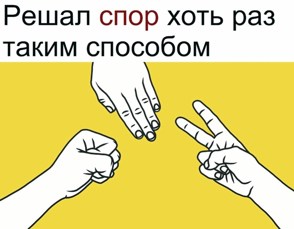

## Rock, Scissors, Paper

Классическая игра Камень, Ножницы, Бумага.

TODO
1. ~~Основной игровой цикл с выходом из него по желанию пользователя.~~
2. ~~Спрашивать у пользователя ввод.~~
3. ~~Вывод графики на экран.~~
4. ~~Определение победителя.~~
5. Подсчет очков.

## Установка

### Скачать

VisualStudio должен быть уже установлен.
[Скачать](https://github.com/Araime/rock-scissors-paper/archive/master.zip) этот репозиторий себе на компьютер.
В папке репозитория открыть файл с расширением `.cpp`.

## Цель проекта

Данный репозиторий создан с целью создания игры на чистом C++.
